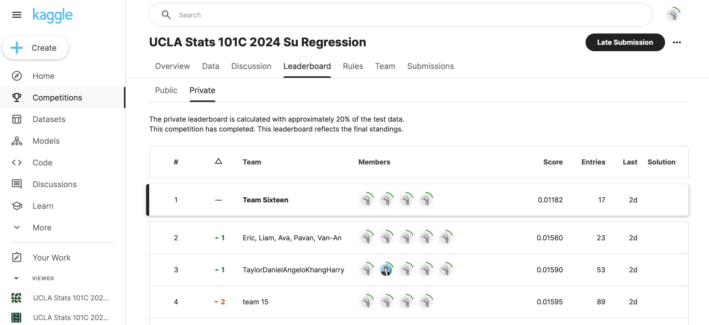

# 1st Place Solution for Amazon Sales Prediction Competition



Competition website: https://www.kaggle.com/competitions/ucla-stats-101-c-2024-su-regression/overview

First place winner of the Kaggle Amazon total sales prediction competition, surpassing the second place solution by 24% and baseline solution by 29%.

Our success hinges on a key insight: that there is more signal (as well as noise) in a fine-grained dataset compared to its aggregated counterpart.

Instead of modelling `train.csv`, we could get finer-grained price predictions on its parent datasets: `amazon_order_details.csv` and `customer_info.csv`. We then aggregated our predictions into the granularity required by the competition.

# Installation

In your terminal, create a new `conda` environment (replace `env_name` by desired name) by running:

```sh
conda create --name env_name --file requirements.txt
```

Then activate this new environment:

```sh
conda activate env_name
```

# Usage

To get predictions, please place these files:

1. `inference_script.py`
2. `utils.py`
3. `model.py`
4. `final_pipeline.pkl`
5. `final_model.pt`

...in the same directory as the three test dataset files:

6. `amazon_order_details_test.csv`
7. `customer_info_test.csv`
8. `test.csv`

Next, naviagte to this directory and run:

```
python inference_script.py
```

This should generate a file called `submission.csv` with predictions on the test dataset, ready for submission on Kaggle.

# Datasets

Our goal is to predict the total sales on Amazon for each state in the US in each month for around 5,000 users that volunteered their purchase history from 2018-2022 as well as filled out a detailed demographic survey. 

The datasets provided for this competition are very interesting. The main dataset, `train.csv`, is an aggregated dataset that combines information from `amazon_order_details.csv` and `customer_info.csv`, which correspond to the purchase history of the volunteers and and demographic survey they filled out, respectively. In summary:

  - `train.csv` - each row corresponds to data about one state in one month of one year.
  - `amazon_order_details.csv` - each row corresponds to one purchase made by one user (user is specified by a unique id).
  - `customer_info.csv` - each row corresponds to one user (specified by the same id).
  
# Methodology

To achieve the competition goal, we first tried to fit models on `train.csv` (see workflow diagram in Figure \ref{coarse_pipeline}) but struggled to achieve scores lower than around 0.017 (public score for baseline model). After noticing that teams on the top of the leaderboard (with 70+ submission entries) are also struggling to achieve scores significantly higher than 0.017, we speculated that maybe `train.csv` only has so much information. After all, `train.csv` is an aggregated dataset and therefore must be more coarse compared to its parent datasets.


Our breakthrough came when instead of modelling `train.csv`, we built models to fit on the inner join of its parent datasets: `amazon_order_details.csv` and `customer_info.csv`, illustrated in Figure \ref{fine_pipeline}.


Notice how in Figure \ref{fine_pipeline}, our predictions were made on a much more fine-grained dataset, where each row corresponds to one purchase made by one customer. Intuitively, a model should be able to more accurately predict the price of a single purchase given the demographic data of that customer than to predict the sum of prices of all purchases made by all customers in a particular state in a particular month given the demographic makeup of that state during that month.

To format our predictions into the proper format, we must aggregate them the exact same way they were aggregated to produce `train.csv`. This proved to be a very difficult part of the pipeline, since reverse-engineering a data transformation pipeline is not easy. Thankfully, professor Chen posted a video where he goes over the steps he took to aggregate data in detail.

# Models

## Coarse-Grained Models

These models were fitted in `R` on `train.csv`:

| ID | Model | Engine | Recipe | Hyperparameters | MSE (CV) |
|:---:|:---:|:---:|:---:|:---:|:---:|
|1| Random Forest | `ranger` | recipe 0 | `trees = 876`, `min_n = 3` | 0.0128 |
|2| Regularized Multiple Linear regression | `glmnet` | recipe 3 | `penalty ~ 0`, `mixture = 0.139` | 0.0757 |
|3| Gradient Boosting Trees | `xgboost` | recipe 2 | `trees = 818`, `min_n = 3`, `tree_depth = 14`, `learn_rate = 0.0823`, `loss_reduction ~ 0`, `sample_size = 0.836`, `stop_iter = 13` | 0.0140 |
|4| Multivariate Adaptive Regression Splines (MARS) | `earth` | recipe 2 | `num_terms = 5`, `prod_degree = 1`, `prune_method = 'backward'` | 0.0157 |
|5| Multi-Layer Perceptron | `nnet` | recipe 3 | `hidden_units = 8`, `penalty ~ 0`, `epochs = 20` | 0.0794 |

## Fine-Grained Models

These models were fitted in `Python` on `amazon_order_details_train.csv` inner-join `customer_info_train.csv`:

| ID | Model | Parameters | Number of Hidden Layers | Hidden Size | Dropout | MSE (test) | Rank |
|:---:|:---:|:---:|:---:|:---:|:---:|:---:|:---:|
|6| 3-Layer MLP | 18,001 | 1 | 120 | 0.2 | 0.0271 | 1 |
|7| 3-Layer MLP | 13,501 | 1 | 90  | 0.5 | 0.0271 | 2 |
|8| 4-Layer MLP | 5,431  | 2 | 30  | 0.5 | 0.0272 | 7 |

# Discussion of Final Model

The final model we selected is model 7, the 3-Layer MLP with 13,501 parameters. This is because it is the model that achieved the lowest MSE on the private leaderboard on Kaggle, securing us first place. 

Prior to the competition deadline, we locked-in on models 7 and 8 as our two final models. This because while model 7 had better performance on the public leaderboard, model 8 is much less complex and thus must be less prone to overfitting. We didn't select model 6 because we didn't want two very similar, very complex models with equally-high risks of overfitting, so we chose model 8 instead. We do not regret this decision because looking back, model 8 outperformed model 6 on the private leaderboard, affirming our suspicion that model 6 was overfit.

Further improvements to this model can be made through better feature engineering. In section 3.1.5, we illustrated how a dataset with 26 columns can essentially be boiled down to 8 meaningful dimensions. Such is also true for the 148-column dataset used in our fine-grained modelling approach. We did not have time to try to sift through the 148 columns and cleverly combine them into more informative and less correlated features. Instead we applied a 10% dropout to the input layer and called it a day. We believe that `orders` is a hugely information-rich dataset, and our modelling approach nowhere near extracted all the signal from the noise. With better feature engineering and more creative model architectures, we are certain better performance can be achieved.
