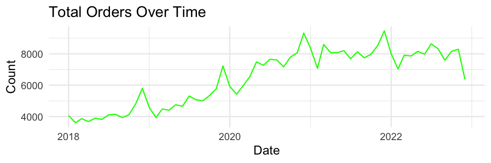

Competition website: https://www.kaggle.com/competitions/ucla-stats-101-c-2024-su-regression/overview

# Introduction

In this report, we detail how we scored first place in the Amazon total sales prediction competition, achieving a score of 0.01182 on the Private Leaderboard, surpassing the second place solution (score = 0.01560) by 24%, and the baseline solution (score = 0.01656) by 29%.

Our success hinges on a key insight: that there is more signal (as well as noise) in a fine-grained dataset compared to its aggregated counterpart.

Instead of modelling `train.csv`, we could get finer-grained price predictions on its parent datasets: `amazon_order_details.csv` and `customer_info.csv`. We then aggregated our predictions into the granularity required by the competition.

# 1. Exploratory Data Analysis

Our goal is to predict the total sales on Amazon for each state in the US in each month for around 5,000 users that volunteered their purchase history from 2018-2022 as well as filled out a detailed demographic survey. 

The datasets provided for this competition are very interesting. The main dataset, `train.csv`, is an aggregated dataset that combines information from `amazon_order_details.csv` and `customer_info.csv`, which correspond to the purchase history of the volunteers and and demographic survey they filled out, respectively. In summary:

  - `train.csv` - each row corresponds to data about one state in one month of one year.
  - `amazon_order_details.csv` - each row corresponds to one purchase made by one user (user is specified by a unique id).
  - `customer_info.csv` - each row corresponds to one user (specified by the same id).
  
The following EDA was done on the main dataset, `train.csv`.

## 1.1. Target Variable

To begin, let us take a look at our target variable, `log_total`:


In Figure \ref{dist}, our target variable `log_total` seems to follow a normal distribution with a slight left-skew. This is to be expected, since this is a log-transformed variable where the original variable is was heavily right-skewed due to the presence of mega-states such as Texas and California where the population is huge and thus the sum of total orders is also huge.

## 1.2. Time and Space

### 1.2.1. Boxplots


Figure \ref{boxplot_state} shows that `log_total` varies widely across different states, where larger states like California and Florida have significantly larger order totals than smaller states like Vermont and Alaska. As such, the State is a strong predictor of `log_total` and should be included in the modelling process.


Figure \ref{boxplot_month} shows that `log_total` does not vary significantly from month to month. Personally, I would expect people to go on shopping sprees during holiday seasons, but the data suggests otherwise. Thus, the month of the purchase is not a strong predictor of `log_total`.

Let's dive deeper into the time and space dimensions of our data through time-series plots and map plots.

### 1.2.2. Time Series Plots


Figure \ref{logtotal_time} shows the log_total over time. From 2018 to 2022, the log_total shows a general increase, indicating a growth in the total orders over this period. There’s an overall upward trend. There are noticeable fluctuations throughout the period, with periodic rises and falls. This suggests variability in the data. Towards the end of the time series, there seems to be some stabilization with less pronounced fluctuations compared to earlier years.



The line plot in Figure \ref{count_time} shows the count of orders from 2018 to 2022.There is a clear upward trend in the total number of orders over the years, indicating growth in activity. This plot is crucial for understanding how total orders have evolved over time, reflecting business growth or market trends. Despite the overall growth, there are fluctuations with noticeable dips, indicating variability in the data.

### 1.2.3. Geographical Plots


In Figure \ref{map}, lighter shade means higher order_totals and darker represents lower order_total values. States exhibit varied average order totals, with some regions showing higher averages. For example, certain states in the Northeast and West have lighter shades, indicating higher average order totals. This visualization helps in identifying high-value markets and regions where average order totals are significant. 

## 1.3. Variable Correlations

### 1.3.1. Scatter Plots

{height=300px}

From the scatter plots in Figure \ref{mf} we see that count of male and female orders all exhibit a positive relationship with `log_total`, which makes sense since more female/male orders -> more total orders -> higher order totals. Note the exhibition of a log function shape due to the variable transformation.


From the scatterplot matrix in Figure \ref{pairs} we see that aside from the log-linear relationship between `count_female`/`count_male` with `log_total`, the two predictor variables also exhibit a potitive linear relationship with one another. This makes total sense since more female users means more total users with implies more male users as well, since the number of female users on amazon should be independent of the number of male users. 

However, note that the predictor variables, including the age and income variables, all exhibit a severe right-skew (as indicated by the distribution curve on the diagonal). The means that in order to fit a linear model using these variables to predict `log_total`, we must also log-transform them.

### 1.3.2. Correlation Matrix


The correlation matrix in Figure \ref{corr} highlights the strength and direction of relationships between variables. For example, count_5to10 and count_2549k have a high positive correlation, indicating that as one increases, the other tends to increase as well. Variables with high correlation to the response variable log_total are potential candidates for inclusion in predictive models.

# 2. Preprocessing

## 2.1. Overview of Methodology

To achieve the competition goal, we first tried to fit models on `train.csv` (see workflow diagram in Figure \ref{coarse_pipeline}) but struggled to achieve scores lower than around 0.017 (public score for baseline model). After noticing that teams on the top of the leaderboard (with 70+ submission entries) are also struggling to achieve scores significantly higher than 0.017, we speculated that maybe `train.csv` only has so much information. After all, `train.csv` is an aggregated dataset and therefore must be more coarse compared to its parent datasets.


Our breakthrough came when instead of modelling `train.csv`, we built models to fit on the inner join of its parent datasets: `amazon_order_details.csv` and `customer_info.csv`, illustrated in Figure \ref{fine_pipeline}.


Notice how in Figure \ref{fine_pipeline}, our predictions were made on a much more fine-grained dataset, where each row corresponds to one purchase made by one customer. Intuitively, a model should be able to more accurately predict the price of a single purchase given the demographic data of that customer than to predict the sum of prices of all purchases made by all customers in a particular state in a particular month given the demographic makeup of that state during that month.

To format our predictions into the proper format, we must aggregate them the exact same way they were aggregated to produce `train.csv`. This proved to be a very difficult part of the pipeline, since reverse-engineering a data transformation pipeline is not easy. Thankfully, professor Chen posted a video where he goes over the steps he took to aggregate data in detail.

In the following two subsections, we will discuss how we pre-processed data for Figure \ref{coarse_pipeline} and for Figure \ref{fine_pipeline} separately.

## 2.2. Data Preprocessing for Coarse-grained Modelling

To begin, we applied `initial_split()` on `train.csv`, stratifying on the  `q_demos_state` to obtain training and testing datasets. We do not want to rely on inference on `test.csv` and submitting to Kaggle to obtain metrics, because (1) it is not good practice since Kaggle competitions have a daily submission limit of on average 5 submissions per day, and (2) it is very easy to create a model that over fits the test dataset, obtaining a high public score and a low private score.

After this, we performed 10-fold cross-validation on the training split using `vfold_cv()`, making sure to also stratify on `q_demos_state`.

### 2.2.1. Feature Engineering

We created several `recipe`s with two goals in mind: (1) certain model types require specific input formats, so we created individual recipes to address this, and (2) whenever possible, we fit every model using as many recipes as possible, with the hopes that a certain combination of feature enginnering steps enables better performance.

The recipes we tried are listed below, all using the formula `log_total ~ .`.

0. *Null* recipe: no modifications.
1. Numeric recipe: for all numeric variables, we apply `step_corr(threshold = 0.8)` to remove correlated variables, `step_normalize()` to scale and center the remaining numeric variables.
2. Categorical recipe: for all categorical variables, we apply `step_dummy()` to get dummy variables.
3. Both: we combine the steps in recipes 1 and 2.

## 2.3. Data Preprocessing for Fine-grained Modelling

### 2.3.1. Why Python

Since we are essentially inserting the modelling procedure in the middle of professor Chen's aggregation pipeline during fine-grained modelling (Figure \ref{fine_pipeline}), it is essential that we are able to accurately reproduce his pipeline. Although he already showcased his `R` pipeline in a video, we decided to painstakingly recreate this pipeline in `Python`. This is because we anticipate that fine-grained modelling will require more complex models to capture all the additional signal in the data, and we just so happen to have a team member who has great familiarity with deep learning in `PyTorch`. Thus, recreating everything related to fine-grained modelling in python makes the entire pipeline easier as we don't have to constantly switch between languages.

### 2.3.2. Feature Engineering

The custom dataset we worked with is the inner join of `amazon_order_details.csv` and `customer_info.csv` using `survey_response_id` as the join key. We named this table `orders`, and the target variable is now `order_totals`. `orders` contains 389,129 observations, each with 26 features. `orders` is a very interesting table: nearly all of its columns are categorical. 

To prepare `orders` for modelling, we first performed train-test split using 20% of the data as test set, stratifying on `q_demos_state`. Instead of creating folds for cross-validation, we followed the standard practice in the deep learning community, which is to further split the training set into a training set and an evaluation set (10% of the original training set is now the evaluation set, stratifying on `q_demos_state` again). This is because we anticipate that we will be fitting some really complex models, and having to re-fit them k times for a more accurate performance metric is not worth the k-fold computational complexity. In the end, our data shapes are as follows:

|  Split  |  Rows  | Columns |
|:-----:|:------:|:----:|
| train | 280173 | 26  |
| eval  | 31131  | 26  |
|	test  | 77826  | 26  |

After data splitting, we used `Sci-kit Learn`'s `Preprocessing` module to build a `ColumnTransformer()` that includes two `pipeline()`s, one that normalizes numerical columns and one that one-hot encodes categorical columns. We fit this pipeline using the training split of the data, and the resultant shapes are as follows:

|  Split  |  Rows  | Columns |
|:-----:|:------:|:----:|
| train | 280173 | 148  |
| eval  | 31131  | 148  |
|	test  | 77826  | 148  |

# 3. Candidate Models

Due to the bi-directional nature of our approach, I am going to talk separately about our candidate models for coarse-grained and for fine-grained modelling.

## 3.1. Coarse-Grained Models

The following models were `tune()`ed using 10-fold cross-validation on the training split of `train.csv`. All were done in `R`. Note that the provided MSE scores are the averaged cross-validation results of the best-performing model Their true performance on the the test split is slightly lower, and their performance on `test.csv` is even lower still. This is indicative of overfitting. All provided hyperparameter settings are `tune()`ed with the exception of `epochs` of model 5, which we artificially set to 20 in the hopes that the neural network can get enough training.

| ID | Model | Engine | Recipe | Hyperparameters | MSE (CV) |
|:---:|:---:|:---:|:---:|:---:|:---:|
|1| Random Forest | `ranger` | recipe 0 | `trees = 876`, `min_n = 3` | 0.0128 |
|2| Regularized Multiple Linear regression | `glmnet` | recipe 3 | `penalty ~ 0`, `mixture = 0.139` | 0.0757 |
|3| Gradient Boosting Trees | `xgboost` | recipe 2 | `trees = 818`, `min_n = 3`, `tree_depth = 14`, `learn_rate = 0.0823`, `loss_reduction ~ 0`, `sample_size = 0.836`, `stop_iter = 13` | 0.0140 |
|4| Multivariate Adaptive Regression Splines (MARS) | `earth` | recipe 2 | `num_terms = 5`, `prod_degree = 1`, `prune_method = 'backward'` | 0.0157 |
|5| Multi-Layer Perceptron | `nnet` | recipe 3 | `hidden_units = 8`, `penalty ~ 0`, `epochs = 20` | 0.0794 |

### 3.1.1. Random Forest

Random forests randomize the variables used when creating a tree in addition to the use of bagging the observations in the data. By using this method, the collection of trees in a random forest is decorrelated compared to the trees produced by bagging and optimally produces highly diverse trees. This allows the resulting prediction made by the aggregate of all trees to improve. 

Higher `trees` tends to improve performance and stabilize predictions, but also slows down computation. The `min_n` hyperparameter determines the minimum number of leaves required to split an internal node which prevents small splits and controls tree growth. 

### 3.1.2. Regularized Multiple Linear Regression

The purpose of regularized multiple linear regression is to enhance the model and mitigate overfitting. We experimented with regularized multiple linear regression, tuning the penalty parameter and the mixture percentage for L1 (Lasso Regression) vs L2 (Ridge Regression) regularization, but found that the optimal model had 0 regularization, indicating that our model did not benefit significantly from regularization.

Based on our EDA findings in the scatter plots (see 1.3.1), log-transforming the predictors could improve model performance by better capturing the log-linear relationships between features and the target variable. This might allow for a more accurate and interpretable model.

### 3.1.3. Gradient Boosting Trees

Gradient boosting produces a prediction model in the form of decision trees. It combines the predictions of several base estimators to improve generalizability. `XGBoost` is an optimized implementation of the gradient boosting known to be highly efficient and flexible. Generally speaking, gradient boosting trees are prone to overfitting, since this model can create super complex trees (i.e. large trees, large forests). 

Interestingly, `xgboost` found a forest size (i.e. `trees`) very similar to the random forest model and a `min_n` identical to that of the random forest. Disappointingly, it failed to yield better performance.

### 3.1.4. Multivariate Adaptive Regression Splines (MARS)

MARS applies non-linear features to linear regression models, making it an extension of linear models. It’s well-suited for high-dimensional problems with many input variables like the amazon data set. The model's hyperparameters contain a tuning parameter that adjusts the number of terms to retain. The number of retained terms influences the trade-off between model accuracy and simplicity. There is also a degree parameter which determines the complexity of the piece-wise linear functions. Higher degrees allow more flexibility but risk overfitting. This emphasizes the balance and trade-off between model complexity and interpretability. The algorithm is computationally fast at making predictions across many values of  parameters from a single model fit, yet we can see that it tends to not perform as well as nonlinear methods like random forests and gradient boosting methods. Perhaps improvements can be made via regularization of the terms to prevent overfitting the data or combining MARS with other models for increased performance.

### 3.1.5. Multi-Layer Perceptron (MLP)

The `parsnip` package only seems to support MLPs with one single hidden layer. This kind of hinders the potential of MLPs, since between every layer in an MLP is an activation function which is what enables the MLP to learn non-linear patterns in the data. The more layers an MLP has, the more it is able to learn complex patterns.

Despite this drawback, it is interesting to see that the best performing model has 8 hidden units in its hidden layer. These 8 features potentially correspond to the 8 broad categories in the 33 columns:

1. Geographical/Temporal info: `q_demos_state`, `year`, `month`.
2. Population info: `count`, `count_female`, `count_male`.
3. Amazon-dependence info: `count_5to10`, `count_over10`.
4. Household size info: `count_hh1`, `count_hh2`, `count_hh3`, `count_hh4`.
5. Account sharing info:  `count_howmany1`, `count_howmany2`, `count_howmany3`, `count_howmany4`.
6. Age info: `count_1824`, `count_2534`, `count_3544`, `count_4554`, `count_5564`, `count_65up`.
7. Wealth info: `count_und25k`, `count_2549k`, `count_5074k`, `count_7599k`, `count_100149k`, `count_150kup`.
8. Education info: `count_lessHS`, `count_HS`, `count_B`, `count_G`.

A further analysis could examine activation maps of these 8 hidden neurons to see if this suspected mapping between feature categories and neurons is indeed true.

## 3.2. Fine-Grained Models

### 3.2.1. Model Architecture

In total, we fitted 90 MLPs with differing hyperparameters. All models shared the same engine, i.e. `PyTorch`, and the same preprocessing pipeline (see 2.3.2). The model architecture is illustrated in Figure \ref{nn}.

{height=400px}

In summary, all models have an input layer of size 148 corresponding to the 148 columns after feature engineering, and a output layer of size 1 which is the final prediction of order price. In between these two layers is `num_hidden_layers` hidden layers, each of size `hidden_size`. In addition to these layers, all hidden layers have a dropout layer which randomly disables `hidden_dropout` proportion of the neurons in that hidden layer. The effect of dropout is a form of regularization to prevent overfitting and an efficient way of model ensembling (`arXiv:1207.0580`). Lastly, a constant 0.1 dropout ratio is applied to the input layer because we have our doubts about whether all 148 of the input features are helpful.

### 3.2.2. Grid Search Results

To fit these models, we ran a customized grid-search of the following hyperparameters:

1. `num_hidden_layers`: 1, 2, 3, 4, 5, 6
2. `hidden_size`: 10, 30, 60, 90, 120
3. `hidden_dropout`: 0.2, 0.5, 0.7.

The combination of these hyperperameters produced 90 unique models. After ranking them by performance, three models stood out to us:

| ID | Model | Parameters | Number of Hidden Layers | Hidden Size | Dropout | MSE (test) | Rank |
|:---:|:---:|:---:|:---:|:---:|:---:|:---:|:---:|
|6| 3-Layer MLP | 18,001 | 1 | 120 | 0.2 | 0.0271 | 1 |
|7| 3-Layer MLP | 13,501 | 1 | 90  | 0.5 | 0.0271 | 2 |
|8| 4-Layer MLP | 5,431  | 2 | 30  | 0.5 | 0.0272 | 7 |

Model 6 stood out because it achieved the lowest MSE on the testing split.

Model 7 stood out because it achieved near-identical performance as model 6 while using ~5,000 fewer parameters, all the while being more strongly regularized as indicated by its higher dropout ratio. This Shows that perhaps model 6 is overfit.

Model 8, despite ranking 7th, stood out to us since it has the fewest number of parameters among the top-10 models. With only a third of the parameters of the top model, model 8 performed only slightly worse on the testing split while being more strongly regularized. It is notable that unlike models 6 and 7, model 8 has an additional hidden layer. Perhaps model 8 makes up for the loss in model complexity due to having fewer parameters through having an additional layer of non-linearity. This shows the potential of MLPs to model arbitrarily complex relationships.

### 3.2.3. Additional Insights from Grid Search Results


In Figure \ref{params}, we see that the performance of MLPs does not necessarily increase as the number of parameters it has increases. With dropout ratio held constant, the lowest MSE's were achieved by models with fewer than 20,000 parameters. 

{width=700px}

However, performance varies wildly due to difference in model architecture. In Figure \ref{arch}, we plotted MSE against `hidden_size` for each model depth (i.e. `num_hidden_layers`), while holding dropout ratio constant. As we can see, the models with the lowest MSEs were all models with `hidden_size` < 60. The best performing "*plot*" here is plots 1 and 2, corresponding to models with 1 and 2 hidden layers, respectively. This aligns with our findings in 3.2.1. In fact, models 6 and 7 correspond to models on the "right side" of plot 1 (i.e. 1 large hidden layer), while model 8 correspond to models in the "elbow" of plot 2 (i.e. 2 small hidden layers).

It is noteworthy that the effect of dropout on model performance is rather insignificant compared to the effect of architecture, though in general we see that as models get more complicated, higher dropout ratios tend to correlate with lower MSE.

# 4. Discussion of Final Model

The final model we selected is model 7, the 3-Layer MLP with 13,501 parameters. This is because it is the model that achieved the lowest MSE on the private leaderboard on Kaggle, securing us first place. 

Prior to the competition deadline, we locked-in on models 7 and 8 as our two final models. This because while model 7 had better performance on the public leaderboard, model 8 is much less complex and thus must be less prone to overfitting. We didn't select model 6 because we didn't want two very similar, very complex models with equally-high risks of overfitting, so we chose model 8 instead. We do not regret this decision because looking back, model 8 outperformed model 6 on the private leaderboard, affirming our suspicion that model 6 was overfit.

Further improvements to this model can be made through better feature engineering. In section 3.1.5, we illustrated how a dataset with 26 columns can essentially be boiled down to 8 meaningful dimensions. Such is also true for the 148-column dataset used in our fine-grained modelling approach. We did not have time to try to sift through the 148 columns and cleverly combine them into more informative and less correlated features. Instead we applied a 10% dropout to the input layer and called it a day. We believe that `orders` is a hugely information-rich dataset, and our modelling approach nowhere near extracted all the signal from the noise. With better feature engineering and more creative model architectures, we are certain better performance can be achieved.


\pagebreak

# Appendix 1: Final Annotated Script

## Video Showing Randomness in Inference Script

`https://youtu.be/vNsP3SHf1Oo`

## Description of Inference Script

We have submitted a `.zip` file under script submission in BruinLearn. Please unpack it. It contains the following `Python` files:

1. `inference_script.py`
2. `utils.py`
3. `model.py`
4. `final_pipeline.pkl`
5. `final_model.pt`

Please place these files in the same directory as the three test `.csv` files:

6. `amazon_order_details_test.csv`
7. `customer_info_test.csv`
8. `test.csv`

Next, using an environment with the basic machine learning packages installed (or even better: just use `Google Colab`!), run:

```
python inference_script.py
```

## Why we have so many files

We are strong believers in the necessecity of good programming practices in data science. That is why we have tried our hardest to make our code modular instead of having them all be in a notebook file.

\pagebreak

# Appendix 2: Team Member Contribution

## Mehwish Ahmed

random forest model predictions via Kaggle/random forest modeling, candidate models table, candidate model descriptions, RMLR/GMT model descriptions (Section 3.1.2,3.1.3).

## Eric Liu

random forest modeling and predictions, exploratory data analysis 

## Andy Wang

All Python work, main report writing/editing, team GitHub maintenance.

## Makenzie White

initialized group chat and regression report document, random forest model predictions and modeling, mlr predictions and modeling, model evaluation and tuning in report, performance model summary and autoplot in report, candidate model descriptions for section 3.1.1 and 3.1.4 in report.
