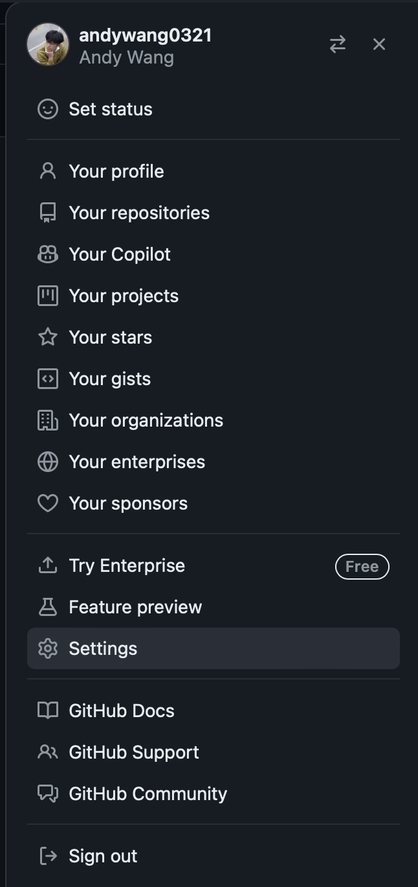
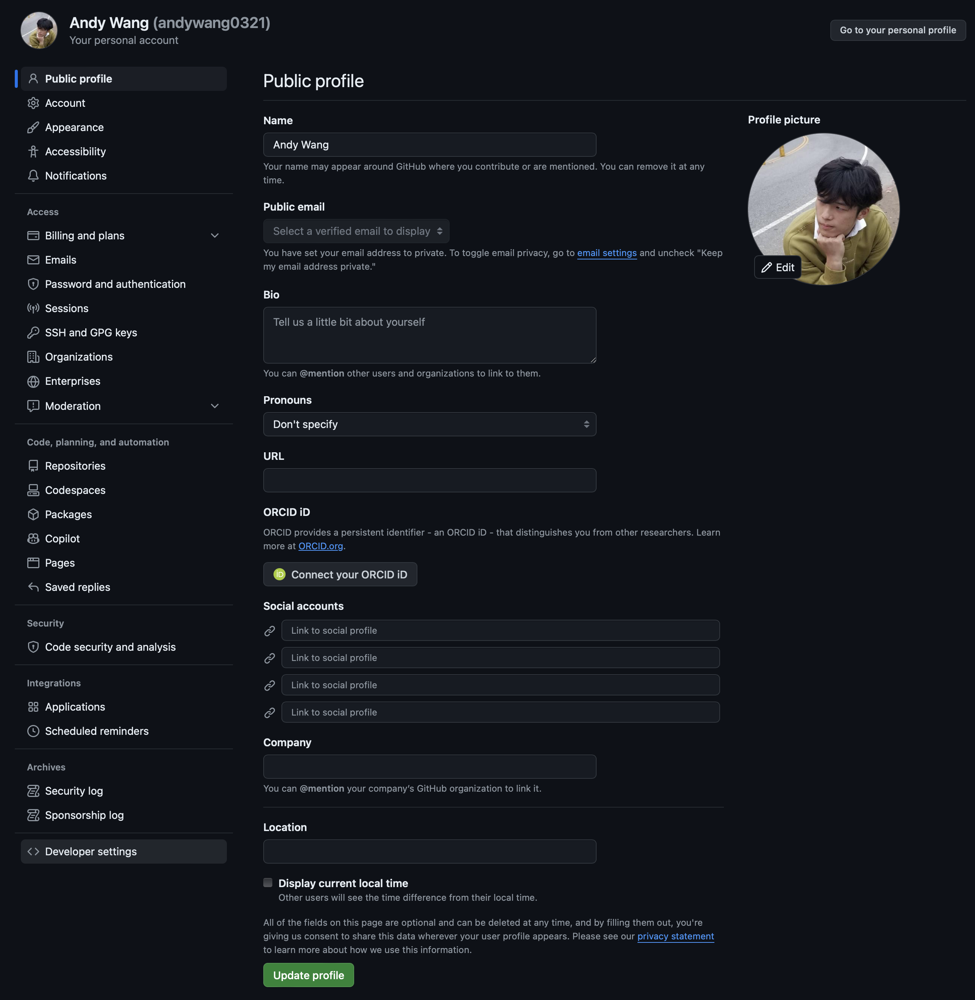
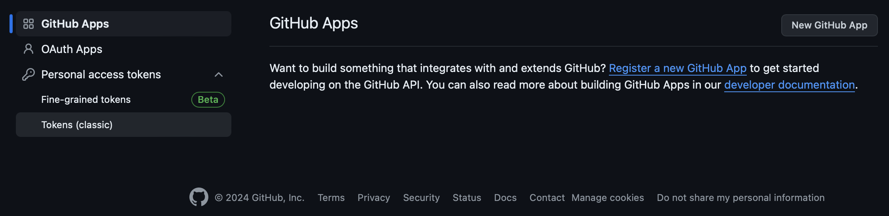
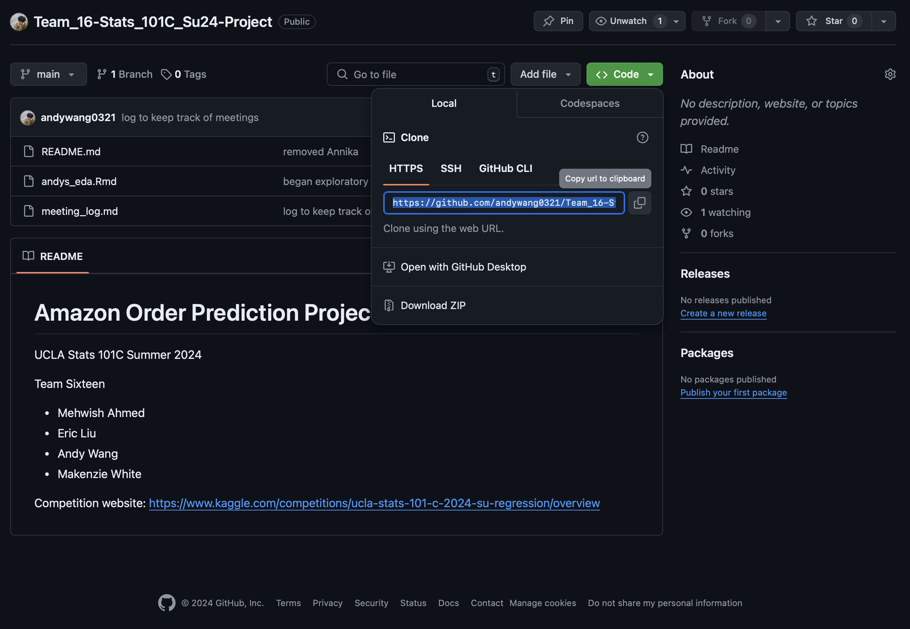
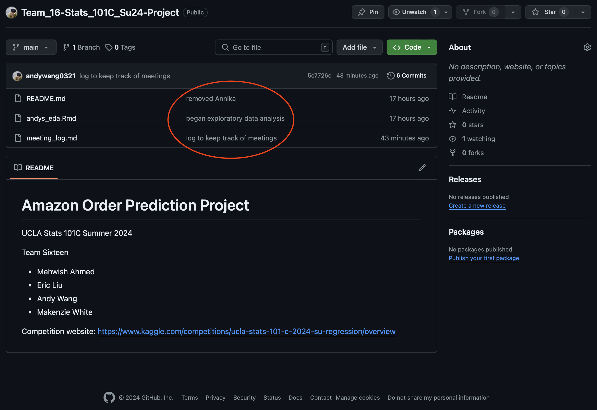
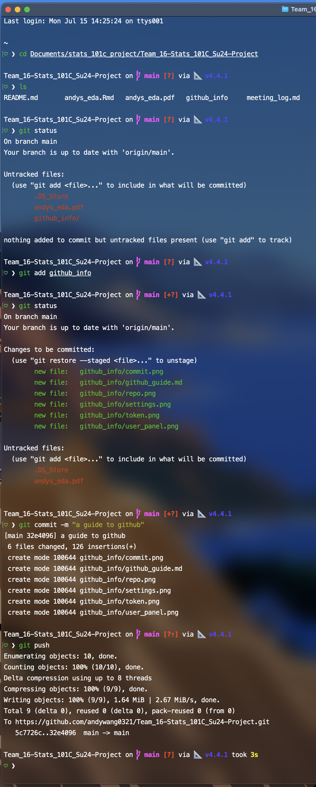

# A guide to using github for team project

By Andy Wang

## Authenticating GitHub CLI

**Git and GitHub are two different things.** While you can make changes to the repo on your local machine using Git, you cannot publish these changes to the GitHub repository unless you login. To do this, you should install the GitHub CLI (Command Line Interface). Go to https://github.com/cli/cli and scroll down to the **Installation** section, find your computer's OS and follow the instructions.

Once you have installed the GitHub CLI, you need to get a **Personal Access Token** from GitHub. Personal Access Tokens are like a safer version of the usual username + password combo. We used to be able to do all this using GitHub username + password, but GitHub decided that that is not safe enough so they are now making everyone authenticate using PATs. To get your PAT, go to the top left corner of GitHub and click on your profile picture, then click on `Settings`:



Once in Settings, on the left column, click on the last item `Developer Settings`:



Once in Developer Settings, click on `Personal access tokens` and generate a classic token. **Save that token**. 



You now have a GitHub Personal Access Toekn. You can use it to link your local computer to your GitHub account. To do so, use the following command in the terminal:

```
gh auth login
```

and follow the instructions (if it asks SSH or Web, choose Web) until it asks you for your token. Paste in your token and you should be good to go.

## Cloning the Repository

A *repository* is just a fancy word for **folder**. 

Here is what you see when you open the GitHub repository:



You can **clone** this repository to your local computer using the terminal.
Start by navigating to the place where you want to clone the repository, e.g. `Documents/stats_101c`:

```
cd ~/Documents/stats_101c
```

Once you are in this target location, you can save a copy of this repo by copying the url shown in the screenshot to your terminal via the following command:

```
git clone https://github.com/andywang0321/Team_16-Stats_101C_Su24-Project.git
```

You should see a new folder in `Documents/stats_101c` named `Team_16-Stats_101C_Su24-Project`. You're done!

## Making Changes in the Repo

Now that you've cloned the repo on your local machine, you can add/delete/modify new/existing files all you want. These changes will not be on the public repo until you `add`, `commit`, and `push` them onto the repo.

Everytime before you make any new changes, you should use the command 

```
git pull
```

to "pull" any changes your teammates might have made to the repo onto your local machine. This helps keep your version of the repo up-to-date with everyone's version.

You can check the status of your Git working tree by calling

```
git status
```

This shows you what changes you have made so you can decide whether or not to add them to the shared repo.

Say you created some new files called `linear_regression_model.Rmd` and `scratch_work.R` in the repo and you want to publish `linear_regression_model.Rmd` on the repo while keeping `scratch_work.R` on your local machine. Simply use the `add` command:

```
git add linear_regression.Rmd
```

to **stage** the file. Now that the file has been staged, you can **commit** the changes by calling 

```
git commit -m "tried a linear regression model"
```

Notice that it is good practice to always write a concise commit message. This tells your teammates what changes you made and will show up on the GitHub like this:



But your changes are not online yet! The last step is to **push** your changes to the remote repo (note the vocabulary used here: you `push` your work to the repo for everyone to see, and you `pull` everyone else's work to stay updated):

```
git push
```

If nothing went wrong, your changes should now be uploaded to GitHub. Everyone should be able to see it if they go to the repo website.

In summary, every time you begin working, you should `pull` from the repo to stay updated, and whenever you make changes, you need to go through the `add`-`commit`-`push` procedure to publish your work.

## Demo

Here's how I uploaded this very file onto GitHub in my terminal:



Notice how I called `git status` twice. The first time, there were 3 untracked files: `.DS_Store` (MacOS adds these hidden files in the file browser, I don't know what they do), `andys_eda.pdf` (the knitted version of `andys_eda.Rmd`), and `github_info/` (folder containing this file and all the attached screenshots). 

After calling `git add github_info`, I call `git status` again. This time, 6 files are added to the staging area: this file and all attached screenshots. Note that `.DS_Store` and `andys_eda.pdf` are still untracked because I didn't explicitly add them. 

Next, I called `git commit -m "a guide to github"` to commit the 6 files I added.

Finally, when I am happy with all the changes I've made, I called `git push` to upload the 6 files onto GitHub.

After writing this section, I am going to repeat this process (currently the version on GitHub does not have this Demo section, since I am writing it up right now).

## Where to keep data

I recommend **NOT SAVING THE DATASETS IN THE REPO**. GitHub has a filesize limit for each file, so it is good practice to save your datasets (which could be many gigabytes) in a folder outside of the repository folder, something like this:

```
Documents
|
|--stats_101c
   |
   |--Team_16-Stats_101C_Su24-Project (our repo)
   |  |--README.md
   |  |--meeting_log.md
   |  |-- ...
   |
   |--ucla-stats-101-c-2024-su-regression (data folder)
      |--train.csv
      |--test.csv
      |--...
```

## Miscellaneous

Git is a **Version Controll System**, its purpose is to **keep track of changes in your work**. GitHub, on the other hand, is an online file sharing portal that uses Git.

Learning to use Git and GitHub is crucial for career success, since it is the industry standard for teamwork not just in tech companies. This is because although Google Drive or iCloud or DropBox is easy to use, it gets REALLY MESSY when there are more people on the team. We often end up with *proposal.pdf*, *proposal-1.pdf*, *proposal-2.pdf* ... and a lot of duplicate files or files with minor differences with no idea of who uploaded which one. Older versions of files might be permanantly lost or extremely difficult to retrieve. 

Git is a powerful system that, when used correctly, streamlines the teamworking experience and enables very organized version control. Prof. Miles Chen first taught me how to use Git and GitHub in Stats 21, and it is one of the most useful skills I've learned at UCLA.

To learn more about Git and GitHub, I recommend watching video tutorials on YouTube or taking a course on DataCamp while we still have Premium privileges!