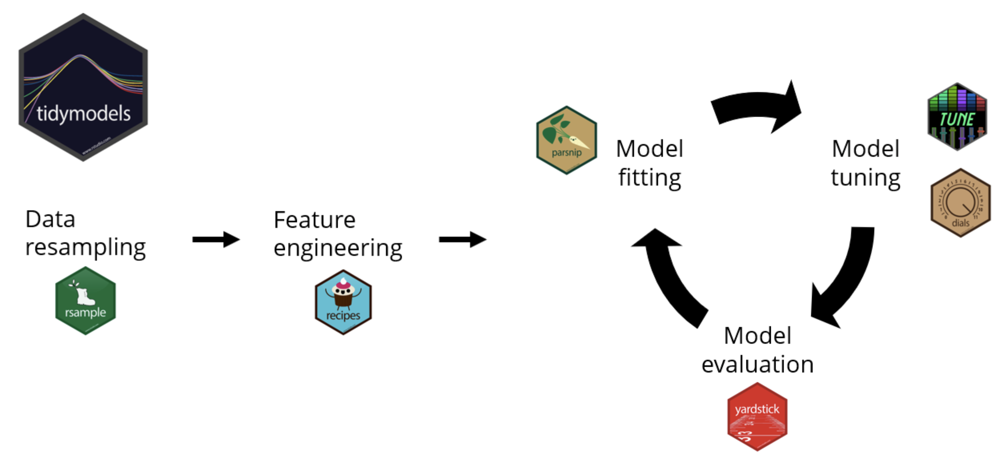
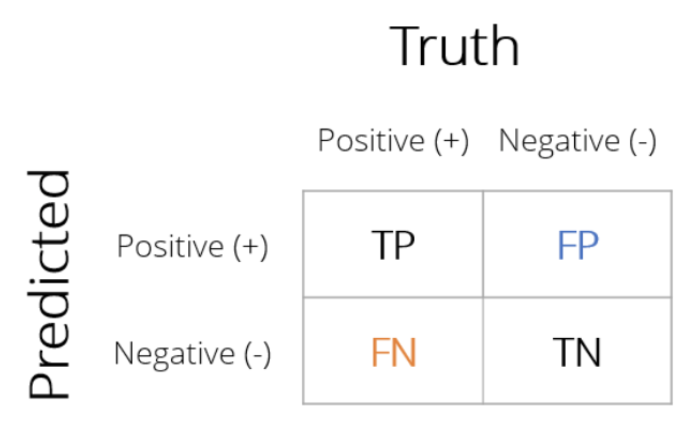
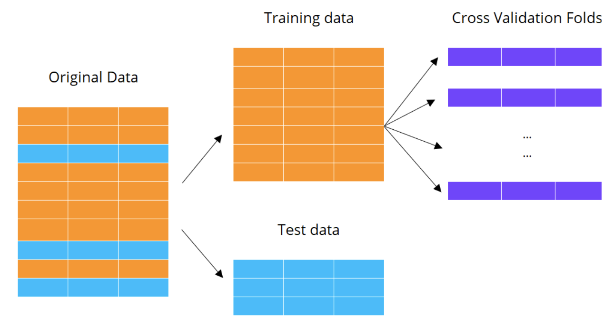

# Cheatsheet for using TidyModels in R

By Andy Wang

Sourse: DataCamp course **Modelling with tidymodels in R**

## Machine Learning with tidymodels

### The tidymodels ecosystem

Tidymodels is a collection of machine learning packages



It deals primarily with **Supervised Learning**, of which there are two types:

- Regression: predicting quantitative outcomes

- Classification: predicting categorical outcomes

#### Data resampling

Use `initial_split()` to create a data split object

Pipe the split object into `training()` and `testing()` to get train and test sets, respectively.

```R
# load package
library(tidymodels)

# create data split object
mpg_split <- initial_split(
    mpg,            # name of dataset to split
    prop = 0.75,    # proportion of data used for training
    strata = hwy    # stratified split based on hwy variable
)

# get training and testing splits from data split object
mpg_training <- mpg_split %>% training()
mpg_test <- mpg_split %>% testing()
```

### Linear regression with tidymodels

Use `parsnip` to fit models to data. Parsnip provides a unified syntax for all kinds of models in R.

Each model requires a **formula** of the following form:

```R
outcome ~ predictor_1 + predictor_2 + ...
outcome ~ . # use all available predictors
```

To use parsnip, we need to
 
1. specify the **model type**
2. specify the **engine**: which R package to use
3. specify the **mode**: regression or classification

```R
# define model spec using parsnip
lm_model <- linear_reg() %>%
    set_engine('lm') %>%
    set_mode('regression')

# pass lm_model to fit()
lm_fit <- lm_model %>%
    fit(hwy ~ cty, data = mpg_training)

# use tidy() to see model summary table
tidy(lm_fit)

# use predict() to get model predictions on new data (or training data)
hwy_predictions <- lm_fit %>%
    predict(new_data = mpg_test)

# compare preds with labels using bind_cols()
mpg_test_results <- mpg_test %>%
    select(hwy, cty) %>%
    bind_cols(hwy_predictions)
```

### Evaluating model performance

Use `yardstick` to evaluate model performance. 
All `yardstick` functions require a `tibble` with model results:

- a column with the true outcome variable
- a column with model predictions

```R
# use rmse() to compute root mean squared error
mpg_test_results %>%
    rmse(truth = hwy, estimate = .pred)

# use rsq() to compute R squared value
mpg_test_results %>%
    rsq(truth = hwy, estimate = .pred)

# we can use ggplot2 to create an R squared plot
ggplot(mpg_test_results, aes(x = hwy, y = .pred)) +
    geom_point() +
    geom_abline(color = 'blue', linetype = 2) +
    coord_obs_pred() +
    labs(
        title = 'R-Squared Plot',
        y = 'Predicted Highway MPG',
        x = 'Actual Highway MPG'
    )

# use last_fit() to streamline final model fitting
lm_last_fit <- lm_model %>%
    last_fit(hwy ~ cty,
             split = mpg_split)

# use collect_metric() to summarize all evaluation metrics
lm_last_fit %>%
    collect_metrics()

# use collect_predictions() to get table of model predictions
lm_last_fit %>%
    collect_predictions()
```

## Classification Models

### Classification models

Instead of predicting numbers, classification models create distinct, non-overlapping regions along set of predictor variable values.

Begin by performing train-test-split

```R
leads_split <- initial_split(
    leads_df,
    prop = 0.75,
    strata = purchased
)

leads_training <- leads_split %>%
    training()
leads_testing <- leads_split %>%
    testing()
```

Use `parsnip` to create logistic regression model from package `glm`

```R
# create logistic_reg() object using parsnip
logistic_model <- logistic_reg() %>%
    set_engine('glm') %>%
    set_mode('classification')

# fit LR model using fit()
logistic_fit <- logistic_model %>%
    fit(
        purchased ~ total_visits + total_time,
        data = leads_training
    )

# get model class predictions using predict()
class_preds <- logistic_fit %>%
    predict(
        new_data = leads_test, 
        type = 'class'          # we want class predictions
    )

# get logits using predict()
prob_preds <- logistic_fit %>%
    predict(
        new_data = leads_test,
        type = 'prob'
    )
```

Use `yardstick` to evaluate model

```R
# create results tibble using bind_cols()
leads_results <- leads_test %>%
    select(purchased) %>%
    bind_cols(class_preds, prob_preds)
```

### Assessing model fit

In `tidymodels`, the outcome variable must be a `factor`, where the first level is the positive class and the second level is the negative class. Check the order with `level()`.

The confusion matrix is a matrix with counts of all combinations of actual and predicted outcome values:



`yardstick` offers many functions to compute evaluation metrics. Use them by passing in the results tibble. Some common metrics are:

- accuracy:

$$
\frac{TP + TN}{TP + TN + FP + FN}
$$

- sensitivity: proportion of all positive cases that were correctly classified
    - *lower false negatives increase sensitivity*

$$
\frac{TP}{TP + FN}
$$

- specificity: the proportion of all negative cases that were correctly classified
    - *lower false positives increse specificity*

$$
\frac{TN}{TN + FP}
$$

- false-positive rate: proportion of false positives among true negatives

$$
1 - \text{specificity}
$$


```R
# create confusion matrix using conf_mat()
conf_mat(
    leads_results,
    truth = purchased,
    estimate = .pred_class
)

# get accuracy using accuracy()
accuracy(
    leads_results,
    truth = purchased,
    estimate = .pred_class
)

# get sensitivity using sens()
sens(
    leads_results,
    truth = purchased,
    estimate = .pred_class
)

# get specificity using spec()
spec(
    leads_results,
    truth = purchased,
    estimate = .pred_class
)

# create a custom set of metrics using metric_set()
custom_metrics <- metric_set(
    accuracy, sens, spec # pass in yardstick metric function names
)
custom_metrics(
    leads_results,
    truth = purchased,
    estimate = .pred_class
)
```

`yardstick` offers many more binary classification metrics:
- `accuracy()`, `kap()`, `sens()`, `spec()`, `ppv()`, `npv()`, `mcc()`, `j_index()`, `bal_accuracy()`, `detection_prevalence()`, `precision()`, `recall()`, `f_meas()`

```R
# passing conf_mat() into the summary() function computes all metrics at once
conf_mat(
    leads_results,
    truth = purchased,
    estimate = .pred_class
) %>%
    summary()
```

### Visualizing model performance

Confusion matrices generated by the `conf_mat()` function can be visualized using `autoplot()`

```R
# use type = 'heatmap' to generate heatmap
conf_mat(
    leads_results,
    truth = purchased,
    estimate = .pred_class
) %>%
    autoplot(type = 'heatmap')

# use type = 'mosaic' to generate mosaic plot
# mosaic plots visually display sensitivity and specificity
    # height of TP and TN columns show sens and spec, respectively
conf_mat(
    leads_results,
    truth = purchased,
    estimate = .pred_class
) %>%
    autoplot(type = 'mosaic')
```

We may want to access model performance across a range of classification thresholds. The Receiver Operating Characteristic (ROC) curve does this by plotting 1 - specificity (false positive rate) vs. sensitivity across unique thresholds in test set results.
- proportion correct among actual positives vs. proportion incorrect among actual negatives.
- ideally, a classification model produces points close to the left upper edge across all thresholds.
- a model that produces points along the diagonal line is akin to randomly flipping a coin (bad).

A good way to summarize the ROC curve is through the Area Under the ROC Curve (ROC AUC). This can be viewed as a "letter grade" of classification performance.

```R
# use roc_curve() to get tibble of specificity and sensitivity values across different thresholds
# note that we use .pred_yes (predicted probability for yes) as thresholds
leads_results %>%
    roc_curve(truth = purchased, .pred_yes)

# use autoplot() to display the ROC curve
leads_results %>%
    roc_curve(truth = purchased, .pred_yes) %>%
    autoplot()

# use roc_auc() to calculate the ROC AUC score
roc_auc(
    leads_results,
    truth = purchased,
    .pred_yes           # use .pred_yes as thresholds
)
```

### Automating the modeling workflow

We can automate this entire process using `last_fit()`. 

```R
# train test split
leads_split <- initial_split(
    leads_df,
    strata = purchased
)

# initialize LR model
logistic_model <- logistic_reg() %>%
    set_engine('glm') %>%
    set_mode('classification')

# use last_fit() to train on data split
logistic_last_fit <- logistic_model %>%
    last_fit(
        purchased ~ total_visits + total_time,
        split = leads_split
    )

# use collect_metric() to get test metrics
logistic_last_fit %>%
    collect_metrics()

# use collect_predictions() to get predictions
logistic_last_fit %>%
    collect_predictions()

# use metric_set() to get more metrics
custom_metrics <- metric_set(
    accuracy, sens, spec, roc_auc
)
custom_metrics(
    last_fit_results,
    truth = purchased,
    estimate = .pred_class,
    .pred_yes               # put thresholds as last argument
)
```

## Feature Engineering

### Feature engineering

The `recipies` package helps easily preprocess data. We begin by creating a `recipe()` and then adding preprocessing steps using the `step_*()` functions.

`recipe` objects are trained on data, typically training split data. It saves stats such as the mean and sd. We train a recipe using the `prep()` function.

The final step is to apply the trained recipe to all data prior to modelling. This is done using the `bake()` function.

```R
# create recipe to log-transform total_time column
leads_log_rec <- recipe(
    purchased ~ .,                  # specify that purchased is outcome variable
    data = leads_training           # train recipe on training set
) %>%
    step_log(total_time, base = 10) # add log transformation on total_time

# summarize recipe using summary()
leads_log_rec %>%
    summary()

# train recipe using prep()
leads_log_rec_prep <- leads_log_rec %>%
    prep(training = leads_training)

# use trained recipe to process training data using bake()
leads_log_rec_prep %>%
    bake(new_data = NULL)   # new_data = NULL applies transformation to training data

# process test data using bake()
leads_log_rec_prep %>%
    bake(new_data = leads_test) # applies to testing data
```

### Numeric predictors

Correlation measures the strength of a linear relationship between two numeric variables
- ranges from -1 to 1
- highly correlated predictors offer *redundant information* and causes **multicolinearity* problems

Check correlation among numeric variables by creating correlation matrix

```R
leads_training %>%
    select_if(is.numeric) %>%   # select numeric columns
    cor()                       # create correlation matric

# remove correlated values using a recipe
leads_cor_rec <- recipe(
    purchased ~ .,
    data = leads_training
) %>%
    step_corr(
        total_visits, total_time,
        pages_per_visit, total_clicks,
        threshold = 0.9                 # removes correlations > 0.9 or < -0.9
    )

# we don't have to individually specify predictors
# use selector functions like all_numeric() or all_outcomes()
leads_cor_rec <- recipe(
    purchased ~ .,
    data = leads_training
) %>%
    step_corr(
        all_numeric()       # select all numeric columns
        threshold = 0.9
    )
# if outcome is numeric, we can exclude it using -all_outcomes()
```

We can also normalize numeric variables by subtracting the mean and dividing the sd

```R
leads_norm_rec <- recipe(
    purchased ~ .,
    data = leads_training
) %>%
    step_corr(
        all_numeric()
        threshold = 0.9
    ) %>%
    step_normalize(all_numeric())   # recipies can have multiple steps
```

### Nominal predictors

One-hot encoding vs. Dummy encoding:
- one-hot creates n new columns, where all are 0 except the group the row belongs to
- dummy creates n - 1 new columns, where one group is "default" if all others are 0.
    - dummy encoding is preferred in tidymodels

```R
recipe(purchased ~ ., data = leads_training) %>%
    step_dummy(all_nominal(), -all_outcomes()) %>%
    prep(training = leads_training) %>%
    bake(new_data = leads_test)
```

### Complete modeling workflow

```R
# train test split
leads_split <- initial_split(leads_df, strata = purchased)
leads_training <- leads_split %>% training()
leads_test <- leads_split %>% testing()

# initialize model
logistic_model <- logistic_reg() %>%
    set_engine('glm') %>%
    set_mode('classification')

# initialize feature engineering pipeline
leads_recipe <- recipe(
    purchased ~ .,
    data = leads_training
) %>%
    step_corr(all_numeric(), threshold = 0.9) %>%
    step_normalize(all_numeric()) %>%
    step_dummy(all_nominal(), -all_outcomes())

# train feature engineering pipeline
leads_recipe_prep <- leads_recipe %>%
    prep(training = leads_training)

# use pipeline to transform training and testing data
leads_training_prep <- leads_recipe_prep %>%
    bake(new_data = NULL)
leads_test_prep <- leads_recipe_prep %>%
    bake(new_data = leads_test)

# train LR model with prepped data
logistic_fit <- logistic_model %>%
    fit(purchased ~ ., data = leads_training_prep)

# obtain model predictions on test data
class_pred <- predict(
    logistic_fit,
    new_data = leads_test_prep,
    type = 'class'
)
prob_preds <- predict(
    logistic_fit,
    new_data = leads_test_prep,
    type = 'prob'
)

# combine results tibble
leads_results <- leads_test %>%
    select(purchased) %>%
    bind_cols(class_preds, prob_preds)

# evaluate model
leads_results %>%
    conf_mat(truth = purchased, estimate = .pred_class)
```

## Workflows and Hyperparameter Tuning

### Machine learning workflows

The `workflow` object combines a `parsnip` model and a `recipe` object to make life easier.

```R
# initialize a workflow object using workflow()
leads_wkfl <- workflow() %>%
    all_model(dt_model) %>%     # add a parsnip model
    add_recipe(leads_recipe)    # add a recipe

# train the workflow using last_fit()
leads_wkfl_fit <- leads_wkfl %>%
    last_fit(split = leads_split)

# get metrics using collect_metrics()
leads_wkfl_fit %>%
    collect_metrics()

# get predictions using collect_predictions()
leads_wkfl_fit %>%
    collect_predictions()

# use metric_set() to create custom set of metrics
leads_metrics <- metric_set(roc_auc, sens, spec)
leads_wkfl_preds %>%
    leads_metrics(
        truth = purchased,
        estimate = .pred_class,
        .pred_yes
    )
```

### Estimating performance with cross validation

K-fold cross-validation is a resampling technique for exploring model performance
- provides K estimates of model performance
- training data is randomly partioned into K sets of roughly equal size
- folds are used to perform K iterations of model fitting and evaluation



For each of the K folds, we pick one for model evaluation and use the rest for model training. We repeat K times until all folds were used for evaluation. This gives us K estimates of model performance.

```R
# set.seed() for reproducibility of results
set.seed(214)

# use vfold_cv() to create a folds object
leads_folds <- vfold_cv(
    leads_training,
    v = 10,                 # number of folds
    strata = purchased
)

# use fit_resamples() to train a parsnip model or workflow object
leads_rs_fit <- leads_wkfl %>%
    fit_resamples(
        resamples = leads_folds,
        metrics = leads_metrics
    )

# get metrics
leads_rs_fit %>%
    collect_metrics()

# summarize = FALSE gives detailed metrics for each fold
rs_metrics <- leads_rs_fit %>%
    collect_metrics(summarize = FALSE)

# results can be summarized with dplyr
rs_metrics %>%
    group_by(.metric) %>%
    summarize(
        min = min(.estimate),
        median = median(.estimate),
        max = max(.estimate),
        mean = mean(.estimate),
        sd = sd(.estimate)
    )
```

Note that models trained with `fit_resamples()` **are not** able to provide predictions on data sources. Calling `predict()` on a resamples object yields an error. 

The purpose of `fit_resamples()` is to compare the performance of different model types.

### Hyperparameter tuning

The `tune()` function from the `tune` package labels hyperparameters for tuning.

```R
# initialize decision tree model with tunable hyperparameters
dt_tune_model <- decision_tree(
    cost_complexity = tune(),
    tree_depth = tune(),
    min_n = tune()
) %>%
    set_engine('rpart') %>%
    set_mode('classification')

# update the leads_wkfl with our new model using update_model()
leads_tune_wkfl <- leads_wkfl %>%
    update_model(dt_tune_model)
```

`tune()` does this by making a grid of all combinations of hyperparameters.

We can use the `parameters()` function from the `dials` package to view hyperparameters being tuned

```R
parameters(dt_tune_model)
```

We can use `grid_random()` to generate random combinations of hyperparameters. This tends to provide a greater chance of finding optimal combinations of hyperparameters.

```R
# for reproducibility
set.seed(214)

# generate random hyperparam combos using grid_random()
dt_grid <- grid_random(
    parameters(dt_tune_model),  # use parameters() function to get parameters
    size = 5
)

# tune the workflow using this grid
dt_tuning <- leads_tune_wkfl %>%
    tune_grid(
        resamples = leads_folds,
        grid = dt_grid,
        metrics = leads_metrics
    )

# get metrics
dt_tuning %>%
    collect_metrics()
```

### Selecting the best model

Just like before, we can use `collect_metrics(summarize = FALSE)` to get detailed model performance metrics on each fold. In this example, we will get 150 rows total because there are 10 folds x 3 metrics x 5 parameters combos.

```R
# use dplyr to create custom summary table of metrics
dt_tuning %>%
    collect_metrics(summarize = FALSE) %>%
    filter(.metric == 'roc_auc') %>%
    group_by(id) %>%                        # fold number
    summarize(
        min_roc_auc = min(.estimate),
        median_roc_auc = median(.estimate),
        max_roc_auc = max(.estimate)
    )
# this allows us to check if the roc_auc score is consistent across folds

# use show_best() to display top n models based on average value of metric
dt_tuning %>%
    show_best(metric = 'roc_auc', n = 5)

# use select_best() to get tibble with best performing model and hyperparam values
best_dt_model <- dt_tuning %>%
    select_best(metric = 'roc_auc')

# use finalize_workflow() to get a workflow with optimized hyperparameter values
final_leads_wkfl <- leads_tune_wkfl %>%
    finalize_workflow(best_dt_model)

# the finalized workflow can then be trained on the original data split using last_fit()
leads_final_fit <- final_leads_wkfl %>%
    last_fit(split = leads_split)

leads_final_fit %>%
    collect_metrics()
```